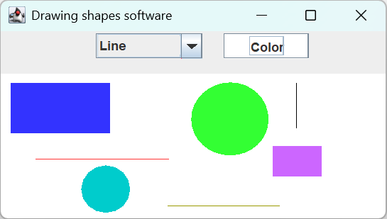
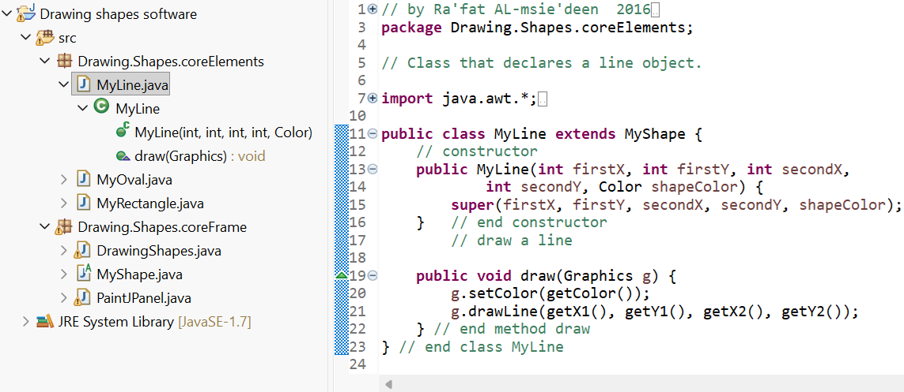

## Drawing Shapes Software

Drawing Shapes Software is a small Java-based graphical application that allows users to draw different types of shapes, such as ovals, rectangles, and lines. The application also provides options for selecting shape colors.

---

## Features

Draw ovals  
Draw rectangles  
Draw lines  
Select shape colors  

 
Figure 1. Graphical user interface of the Drawing Shapes Software during execution.

---

## Technologies

Java  
Java Swing  

---

## Project Structure

The project is organized into Java packages and classes that implement the drawing functionality, shape management, and graphical user interface.

 
Figure 2. Source code of the Drawing Shapes Software.

---

## Getting Started

### Prerequisites

Java Development Kit (JDK)  
Java-compatible IDE such as Eclipse, IntelliJ IDEA, or NetBeans   

---

## Running the Application

1. Clone this repository.  
2. Open the project in your preferred Java IDE.  
3. Build the project.  
4. Run the main application class.  

---

#### License

This project is provided for educational and development purposes.

@Ra'Fat Ahmad Al-Msie'Deen - 2026
