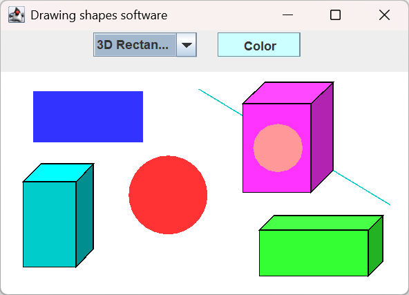

## Drawing Shapes Software

Drawing Shapes Software is a small Java-based graphical application that allows users to draw different types of shapes, such as ovals, rectangles, and lines. The application also provides options for selecting shape colors.

---

## Features

Draw ovals  
Draw rectangles  
Draw lines  
Select shape colors  

 
Figure 1. Graphical user interface of the Drawing Shapes Software during execution.

---

## Technologies

Java  
Java Swing  

---

## Project Structure

The project is organized into Java packages and classes that implement the drawing functionality, shape management, and graphical user interface.

 
Figure 2. Source code of the Drawing Shapes Software.

---

## Getting Started

### Prerequisites

Java Development Kit (JDK)  
Java-compatible IDE such as Eclipse, IntelliJ IDEA, or NetBeans   

---

## Running the Application

1. Clone this repository.  
2. Open the project in your preferred Java IDE.  
3. Build the project.  
4. Run the main application class.  

---

## Drawing Shapes Software – Version 2

Drawing Shapes Software – Version 2 is an enhanced version of the previous Drawing Shapes Software. This version preserves the existing drawing functionality while introducing a new 3D Rectangle shape.

The software allows users to draw and work with the following shapes:

- Line
- Rectangle
- Oval
- 3D Rectangle

The main enhancement in Version 2 is the addition of the 3D Rectangle, which extends the shape-drawing capabilities of the previous version. The implementation is based on the previous version, with the new functionality integrated while preserving all existing drawing features.

Therefore, Version 2 provides the same basic drawing capabilities as the previous version while adding support for creating 3D Rectangle shapes, as shown in Figure 3.

 
Figure 3. Graphical user interface of Drawing Shapes Software – Version 2 showing all supported shapes: Line, Rectangle, Oval, and 3D Rectangle.

---

## 📚 Research Background

Drawing Shapes Software [1] is used as an illustrative example in research on software analysis and visualization. The software is analyzed to extract its source-code elements, metrics, and relationships for visualization and analysis [2], [3].

### References

[1] Ra'Fat Al-Msie'deen, “Drawing Shapes Software,” GitHub repository, 2026. [Online]. https://github.com/rafat66/Drawing-Shapes-Software/.   

[2] R. Al-Msie’deen, “ScaMaha: A Tool for Parsing, Analyzing, and Visualizing Object-Oriented Software Systems,” *International Journal of Computing and Digital Systems*, vol. 17, no. 1, pp. 1–20, 2025.  
[PDF](https://rafat66.github.io/Al-Msie-Deen/img/ScaMaha.pdf)

[3] R. Al-Msie’deen, “Requirements Traceability: Recovering and Visualizing Traceability Links Between Requirements and Source Code of Object-oriented Software Systems,” *International Journal of Computing and Digital Systems*, vol. 14, no. 1, pp. 279–295, 2023.  
[PDF](https://rafat66.github.io/Al-Msie-Deen/img/RT.pdf)

---

#### License

This project is provided for educational and development purposes.

---

@Ra'Fat Ahmad Al-Msie'Deen - 2026
